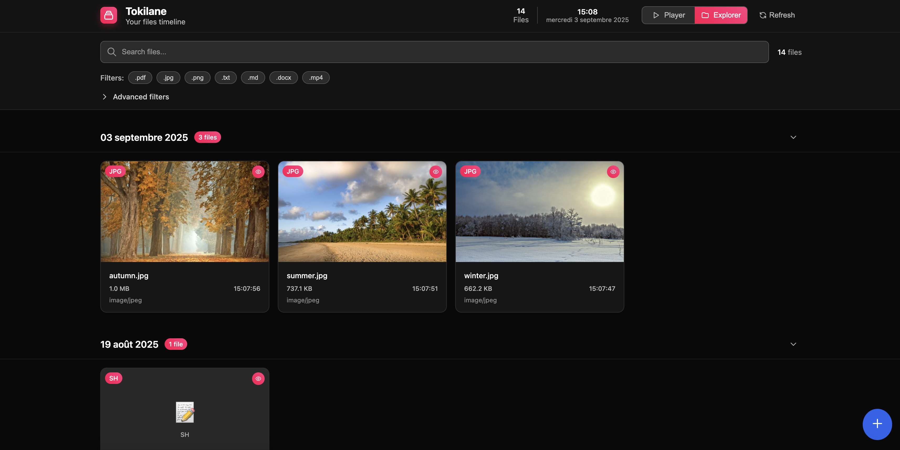

# Tokilane  
📂 A simple tool to visualize your files on a timeline, based on their `createdAt` metadata.

---

## 🚀 Why Tokilane?
Tokilane helps you **see your files in chronological order**.  
It scans your directory and provides a timeline view of file creation dates.
It may be useful to inspect remote files on a SSH session.

---

## 📷 Screenshots
<div align="center" width="100%">
    
    
</div>


---

## 🛠️ Quick Start
Run Tokilane with Docker (replace `./` with your target directory):

```bash
docker run -d \
  --name tokilane \
  -p 1323:1323 \
  -e SCAN_DEPTH=1 \
  -v /tmp/tokilane-data:/app/data \
  -v ./:/app/files \
  jierka/tokilane:latest
```

Then open [http://localhost:1323](http://localhost:1323) in your browser.

### Qucik commands

<details>
  <summary>Undetached</summary>
  
```bash
docker rm tokilane -f ; docker run \
--name tokilane \
-p 1323:1323 \
-e SCAN_DEPTH=1 \
-v /tmp/tokilane-data:/app/data \
-v ./:/app/files \
jierka/tokilane:latest
```
  
</details>

<details>
  <summary>Detached + Logs</summary>
  
```bash
docker rm tokilane -f ; docker run -d \
--name tokilane \
-p 1323:1323 \
-e SCAN_DEPTH=1 \
-v /tmp/tokilane-data:/app/data \
-v ./:/app/files \
jierka/tokilane:latest ; docker logs tokilane -f
```

</details>

---
## ⚙️ Configuration
You can customize Tokilane using environment variables:

```bash
# App language (options: en, fr)
APP_LANG=en

# Enable debug logs
DEBUG=false

# Directory scan depth:
#   0 = unlimited
#   1 = root only
#   2 = root + 1 level, etc.
SCAN_DEPTH=0

# Number of parallel workers for scanning:
#   0 = auto (based on CPU cores)
SCAN_WORKERS=0

# Reset database on startup:
#   WARNING: destroys all index and thumbnails
RESET_DB=true
```

---
## 📄 License
Tokilane is distributed under the MIT License.
Feel free to use, modify, and share it.
